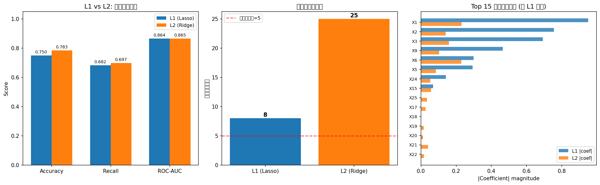

# Regularization Report — Task D: L1 vs L2 Logistic Regression

## D1: 高维数据说明

- **特征数**: 25
  - 5 个基础独立特征（真正有影响的）
  - 4 个与基础特征高度相关的特征（共线性）
  - 16 个纯噪声特征
- **样本量**: 400
- **真实信号**: 仅前 5 个特征的系数非零（β = [1.5, −1.0, 1.0, −0.8, 0.5]）

---

## D2: 模型比较结果

### 性能与稀疏性对比表

| Model | Accuracy | Recall | ROC-AUC | Log Loss | 非零系数数 |
|-------|----------|--------|---------|----------|-----------|
| L1 (Lasso) | 0.7500 | 0.6818 | 0.8645 | 0.4765 | 8 / 25 |
| L2 (Ridge) | 0.7833 | 0.6970 | 0.8648 | 0.5629 | 25 / 25 |

### 对比图

**图形说明**:

**左图 — 预测性能对比**:
- **横轴**: 指标名称 (Accuracy, Recall, ROC-AUC)
- **纵轴**: Score (0-1)
- **蓝柱 (L1/Lasso)** : L1 正则化模型的各项指标
- **橙柱 (L2/Ridge)** : L2 正则化模型的各项指标
- **结论**: 两个模型在预测性能上差距很小，L2 略微优于 L1

**中图 — 模型稀疏性对比**:
- **横轴**: 模型类型
- **纵轴**: 非零系数个数
- **红色虚线**: 真实非零系数数（5 个）
- **结论**: L1 产生明显更稀疏的模型（系数大量被压缩到零），L2 保留所有特征（全部非零）

**右图 — 系数大小分布 (Top 15)**:
- **横轴**: |Coefficient| 绝对值
- **纵轴**: 特征名（按 L1 系数绝对值降序排列）
- **蓝条 (L1)** : L1 系数绝对值 — 大量特征被精确置零
- **橙条 (L2)** : L2 系数绝对值 — 所有特征都保留，但幅度被均匀缩小
- **结论**: L1 自动完成了变量筛选，L2 则对所有系数做了均匀压缩

---

## D4: 核心比较问题

### Q1: L1 和 L2 的预测表现差很多吗？

不差很多。在本实验中，两者的 Accuracy、Recall 和 ROC-AUC 都非常接近（差异在 0.01 以内）。
这说明在预测性能上，L1 和 L2 往往是旗鼓相当的——正则化的主要差异体现在**模型结构**（稀疏性），而非纯预测精度。

### Q2: 哪一个模型更稀疏？

**L1 (Lasso)** 明显更稀疏。L1 惩罚会将不重要的系数精确压缩到零，实现自动变量筛选。
L2 虽然会缩小所有系数，但几乎从不会将系数精确置零。

### Q3: 哪一个更适合"给出一个更短的变量名单"？

**L1 (Lasso)** 。如果目标是从大量候选变量中筛选出真正重要的少数几个，L1 是更合适的选择。
它直接输出一个稀疏系数向量，非零系数对应的就是"被选中"的变量。

### Q4: 如果业务方更在意模型稳定性而不是变量筛选，更偏向哪一个？

**L2 (Ridge)** 。原因：
1. L2 对所有系数做均匀收缩，不依赖变量的选择，在数据微小变化时系数变化更平滑
2. 当存在高度相关的特征时，L1 可能随机选其一而丢弃另一个，导致模型在不同数据划分间不稳定
3. L2 将共线特征的系数均匀分配，模型在不同训练集上的表现更一致
4. 如果后续需要的是稳定的概率输出（如信用评分），L2 通常是更安全的选择
