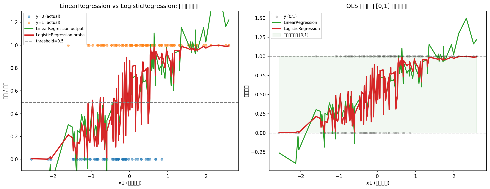
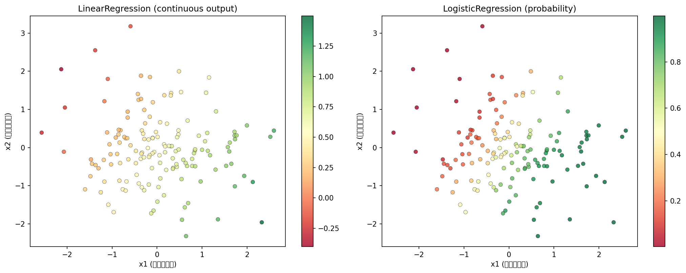
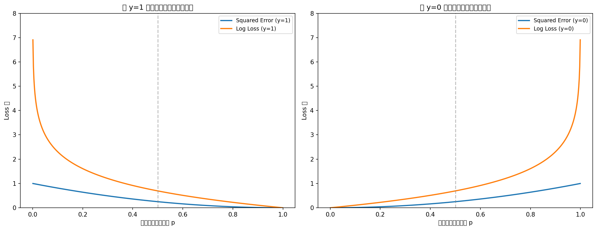
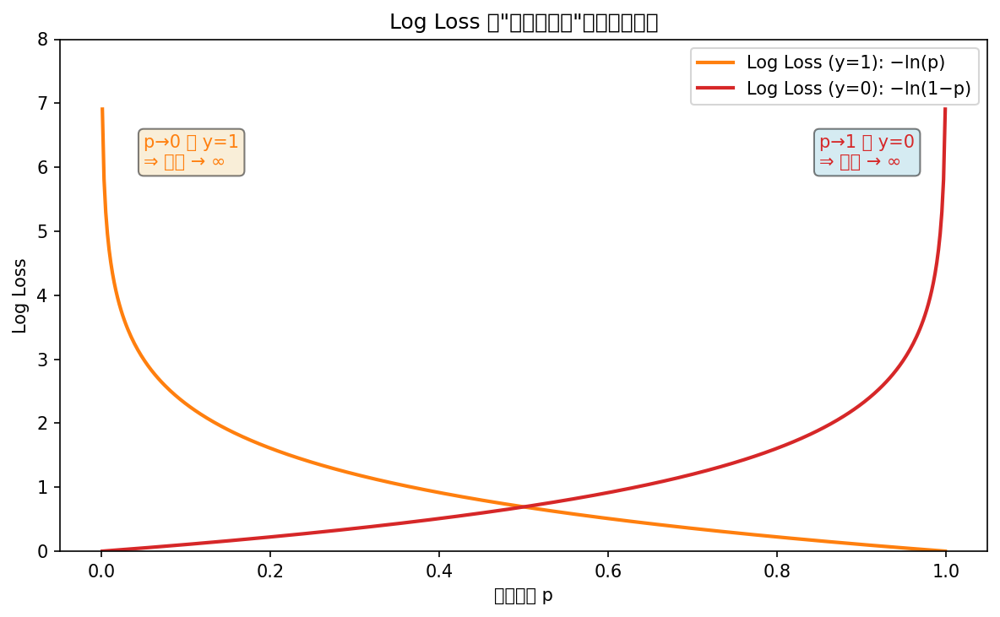

# Synthetic Data Report — Task A & B

## A2: 数据生成机制 (DGP)

- **样本量**: 500
- **特征数**: 4 (x1, x2, x3, x4)，外加截距项
- **DGP**:
  1. 构造线性组合 η = β₀ + β₁·x1 + β₂·x2 + β₃·x3 + β₄·x4
     - β₀ = 0.00, β₁ = 1.50, β₂ = -1.00, β₃ = 0.50, β₄ = 0.01
  2. 通过 sigmoid 转化为概率: p = 1 / (1 + exp(−η))
  3. 从 Bernoulli(p) 采样得到 y

- **变量对正类概率的影响**:
  - **x1** (β₁ = 1.5): **提高**正类概率 — x1 越大，p→1
  - **x2** (β₂ = -1.0): **降低**正类概率 — x2 越大，p→0
  - **x3** (β₃ = 0.5): 轻度提高正类概率
  - **x4** (β₄ = 0.01): 基本无影响（噪声特征）

---

## A3: LinearRegression vs LogisticRegression 并排对比

### LinearRegression 输出问题
- LinearRegression 的输出范围在 [-0.400, 1.499]，
  可能超出 [0, 1] 区间。
- 如果把线性回归的输出直接解释为概率，会出现:
  - 负概率（<0）或大于 1 的"概率"，这在概率公理下没有意义
  - 线性外推导致对极端特征值的预测不可控

### LogisticRegression 的优势
- 通过 sigmoid 函数将线性组合 η 映射到 (0, 1)，天然可解释为概率
- 输出严格在 [0,1] 区间内

---

## A4: 核心对比图

### 图 1: LinearRegression vs LogisticRegression 输出行为对比

**左图说明**:
- **横轴**: x1（主要正影响特征）
- **纵轴**: 模型输出 / 真实标签
- **蓝点**: y=0 的真实样本
- **橙点**: y=1 的真实样本
- **绿线**: LinearRegression 预测输出（连续值）
- **红线**: LogisticRegression 预测概率
- **灰色虚线**: threshold=0.5
- **最想说明的现象**: LinearRegression 输出可以是负数或大于 1，且与 0/1 标签的关系是线性的；
  LogisticRegression 输出被约束在 (0,1) 区间，呈 S 形曲线，与真实标签分布更吻合。

**右图说明**:
- **横轴**: x1
- **纵轴**: 模型输出
- **绿色半透明区域**: 合理概率区间 [0,1]
- **最想说明的现象**: LinearRegression 在 x1 极大或极小时，输出会超出 [0,1] 范围，这使其输出无法被解释为概率。

### 图 2: 二维概率热力图

- **横轴**: x1（正影响特征）
- **纵轴**: x2（负影响特征）
- **颜色**: 模型输出值（红色=高，绿色=低）
- **左图**: LinearRegression 连续输出 — 颜色梯度是线性的
- **右图**: LogisticRegression 概率 — 颜色梯度呈 S 型，决策边界更清晰
- **最想说明的现象**: LogisticRegression 给出了一个平滑、非线性的概率表面，在分类边界处变化更陡峭。

---

## A5: 核心问题回答

**Q1: LinearRegression 在这个任务里最不自然的地方是什么？**

最不自然的地方是输出范围不受 [0,1] 约束。线性回归假设 E[Y|X] = Xβ，当 X 变化很大时，预测值可以是 −∞ 到 +∞ 之间的任何值。
但二分类的 y 只能是 0 或 1，其条件期望 E[Y|X] = P(Y=1|X) 必须在 [0,1] 区间内。
因此线性回归的线性结构在边界处与概率公理直接冲突。

**Q2: 为什么逻辑回归的输出更容易解释成概率？**

因为逻辑回归通过 sigmoid 变换 p = 1/(1+exp(−Xβ))，将线性组合 Xβ 压缩到 (0,1) 区间。
这个变换是单调递增的，意味着当 Xβ 增大时，p 从 0 平滑增长到 1，完全符合"概率"的行为约束。
而且在统计上，这个形式来自 Bernoulli 分布的 canonical link function，有坚实的统计基础。

**Q3: 关键区别是"能不能分类"还是"输出是否有概率意义"？**

关键区别在于**输出是否有概率意义**。如果把 OLS 输出硬阈值化（如 >0.5 → 1），也能"分类"，但：
1. 输出值本身不能被解释为概率
2. 不确定性量化不准确
3. 模型校准度极差
真正让逻辑回归成为分类模型基石的，不是它能输出一个类别标签，而是它的输出本身就是一个被良好校准的概率。

---

## B1: 核心公式

### 1. Bernoulli 分布
$$
Y \sim \text{Bernoulli}(p)
$$

**解释**: 二分类问题中，每个样本的目标变量 Y 是来自 Bernoulli 分布的随机变量。
它只有两个可能的取值（1 或 0），唯一的参数 p 表示"Y=1 发生的概率"。
逻辑回归的核心任务就是为每个样本估计一个合适的 p。

### 2. 单样本 Likelihood
$$
L(p; y) = p^y (1-p)^{1-y}
$$

**解释**: 给定一个（未知的）真实概率 p，观察到标签 y 的 likelihood 可以简洁地写成这个统一形式。
当 y=1 时，likelihood = p（模型说"会发生"且真的发生了）；
当 y=0 时，likelihood = 1−p（模型说"不会发生"且真的没发生）。
这个公式优雅地把两种情况合并为一行。

### 3. 单样本负对数似然（Log Loss）
$$
\ell(p; y) = -\left[ y \ln(p) + (1-y) \ln(1-p) \right]
$$

**解释**: 对 likelihood 取负对数，把乘法（跨样本的独立 Bernoulli 乘积）转化为加法，便于优化。
这就是交叉熵在二分类的特例——它衡量的是预测分布 (p, 1−p) 与真实分布 (y, 1−y) 之间的距离。
最小化 log loss 等价于最大化 likelihood，即 MLE（最大似然估计）。

---

## B2: 损失随预测概率变化图

### 图 3: Squared Error vs Log Loss

- **横轴**: 预测为正类的概率 p ∈ (0,1)
- **纵轴**: Loss 值
- **蓝线**: Squared Error (MSE)
- **橙线**: Log Loss (交叉熵)
- **左图 (y=1)**: 当真实标签为 1 时，预测概率越低，两种 loss 都越大，但 log loss 增长更快
- **右图 (y=0)**: 当真实标签为 0 时，预测概率越高，两种 loss 都越大，log loss 同样增长更快

**核心发现**: 当模型"错得很自信"（如 y=1 但 p→0，或 y=0 但 p→1）时，log loss 趋向无穷大，而 squared error 最多到 1。
这说明 log loss 对"自信的错误"惩罚远重于 squared error。

### 图 4: Log Loss 不对称惩罚

- **橙线**: Log Loss 当 y=1: −ln(p)
- **绿线**: Log Loss 当 y=0: −ln(1−p)
- **最想说明的现象**: log loss 两端（p→0 或 p→1）的不对称增长 — 对同一类错误（自信地判错），惩罚远比小心地判错更重。

---

## B3: 图像现象与统计建模的对应

**Q1: 为什么二分类里"错得很自信"需要被重罚？**

因为在 Bernoulli 建模下，如果真实 p 接近 0 但模型输出 p→1，其 likelihood 接近于 0，取负对数后趋于 ∞。
这意味着从概率上讲，这个样本在模型下的"出现概率"几乎为零——它在告诉我们：你的模型参数非常不合理。
重罚这种极端错误促使模型在不确定时输出接近 0.5 的概率，这是一种"知道自己不知道"的诚实。

**Q2: 为什么说 log loss 不是凭空指定的，而是来自 Bernoulli likelihood？**

log loss 是 Bernoulli 分布的负对数似然，它直接从最大似然估计（MLE）推导出来，不是人为设计的。
假设每个 y 独立来自 Bernoulli(p)，则整个数据集的对数似然为 Σ[y ln(p)+(1−y) ln(1−p)]，
最小化其负值（即 log loss）等价于找到使数据最可能出现的参数——这是统计推断的标准做法，而非任意的损失函数选择。

**Q3: 如果我们已经把输出解释成概率，为什么 log loss 比 MSE 更自然？**

因为 MSE 隐含地假设了"预测误差服从正态分布"，而二分类的 y 是 0/1 的 Bernoulli 变量，绝不服从正态分布。
用 MSE 做二分类相当于用错误的似然函数去做 MLE——这在统计上是不一致的。
log loss 直接来自 Bernoulli distribution，与"输出=概率"的解释完全自洽。
