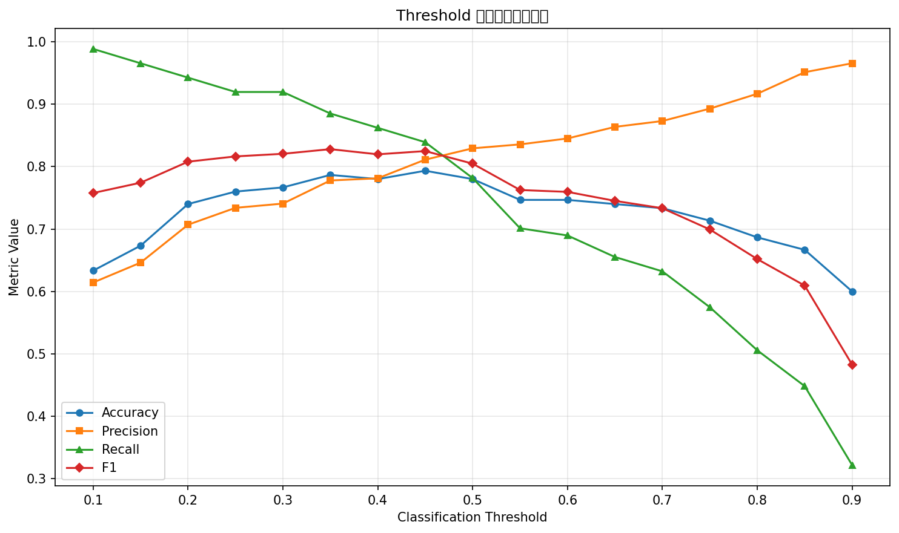

# Threshold Analysis Report — Task B & C

## 注意：Bernoulli 公式已在 synthetic_report.md (B1) 中详细呈现，本报告聚焦 Task C。

---

## C1: 混淆矩阵与基础指标（threshold=0.5）

### 混淆矩阵

|  | 预测 Positive | 预测 Negative |
|--|---------------|---------------|
| **实际 Positive** | TP = 68 | FN = 19 |
| **实际 Negative** | FP = 14 | TN = 49 |

### 基础分类指标

| 指标 | 值 | 公式 | 含义 |
|------|----|----|------|
| Accuracy | 0.7800 | (TP+TN)/Total | 整体正确率 |
| Precision | 0.8293 | TP/(TP+FP) | 预测为正的样本中真正为正的比例 |
| Recall | 0.7816 | TP/(TP+FN) | 真正为正的样本中被正确识别的比例 |
| F1 | 0.8047 | 2×P×R/(P+R) | Precision 和 Recall 的调和平均 |
| ROC-AUC | 0.8551 | — | 模型区分正负类的能力（阈值无关） |

---

## C2 & C3: Threshold 扫描

### Threshold 扫描结果表

| Threshold | TP | TN | FP | FN | Accuracy | Precision | Recall | F1 |
|-----------|----|----|----|----|----------|-----------|--------|----|
| 0.10 | 86 | 9 | 54 | 1 | 0.6333 | 0.6143 | 0.9885 | 0.7577 |
| 0.15 | 84 | 17 | 46 | 3 | 0.6733 | 0.6462 | 0.9655 | 0.7742 |
| 0.20 | 82 | 29 | 34 | 5 | 0.7400 | 0.7069 | 0.9425 | 0.8079 |
| 0.25 | 80 | 34 | 29 | 7 | 0.7600 | 0.7339 | 0.9195 | 0.8163 |
| 0.30 | 80 | 35 | 28 | 7 | 0.7667 | 0.7407 | 0.9195 | 0.8205 |
| 0.35 | 77 | 41 | 22 | 10 | 0.7867 | 0.7778 | 0.8851 | 0.8280 |
| 0.40 | 75 | 42 | 21 | 12 | 0.7800 | 0.7812 | 0.8621 | 0.8197 |
| 0.45 | 73 | 46 | 17 | 14 | 0.7933 | 0.8111 | 0.8391 | 0.8249 |
| 0.50 | 68 | 49 | 14 | 19 | 0.7800 | 0.8293 | 0.7816 | 0.8047 |
| 0.55 | 61 | 51 | 12 | 26 | 0.7467 | 0.8356 | 0.7011 | 0.7625 |
| 0.60 | 60 | 52 | 11 | 27 | 0.7467 | 0.8451 | 0.6897 | 0.7595 |
| 0.65 | 57 | 54 | 9 | 30 | 0.7400 | 0.8636 | 0.6552 | 0.7451 |
| 0.70 | 55 | 55 | 8 | 32 | 0.7333 | 0.8730 | 0.6322 | 0.7333 |
| 0.75 | 50 | 57 | 6 | 37 | 0.7133 | 0.8929 | 0.5747 | 0.6993 |
| 0.80 | 44 | 59 | 4 | 43 | 0.6867 | 0.9167 | 0.5057 | 0.6519 |
| 0.85 | 39 | 61 | 2 | 48 | 0.6667 | 0.9512 | 0.4483 | 0.6094 |
| 0.90 | 28 | 62 | 1 | 59 | 0.6000 | 0.9655 | 0.3218 | 0.4828 |

### Threshold 曲线图

**图形说明**:
- **横轴**: Classification Threshold (分类阈值)
- **纵轴**: Metric Value (指标值)
- **蓝线 (Accuracy)** : 整体正确率
- **橙线 (Precision)** : 查准率
- **绿线 (Recall)** : 查全率
- **红线 (F1)** : F1 分数

**观察到的 trade-off**:
- 当阈值升高时，Precision 通常**上升**（更保守，只在高置信度时预测正类）
- 当阈值升高时，Recall 通常**下降**（更多正类样本被漏掉）
- Accuracy 在阈值接近正类比例时达到峰值
- F1 在 Precision 和 Recall 的交叉点附近达到最大值
- 这张图展示了经典的 precision-recall trade-off：无法同时最大化两个指标

---

## C4: 业务场景分析 — 疾病初筛

### 最在意哪个指标？

在**疾病初筛**场景中，最在意 **Recall（召回率）**。

### 为什么？

因为漏诊（假阴性）的代价远高于误诊（假阳性）：
- 漏诊意味着患者未能及时得到治疗，可能延误病情甚至危及生命
- 误诊可以通过进一步的确认检查来排除，成本相对可控

因此，在初筛阶段，宁可多花资源做后续确认，也不能放过任何一个可能的阳性病例。

### 推荐阈值及理由

我会推荐一个**较低的阈值（如 0.3）**：
- 较低阈值可以最大限度地提高 Recall，尽可能减少漏诊
- 虽然 Precision 会因此降低（会有更多假阳性），但这在初筛阶段是可接受的
- 后续可以用更精确（也更昂贵）的检测手段对初筛阳性者进行二次筛查
- 具体阈值应根据可用的确认检查资源来确定：如果资源充足，阈值可以更低
