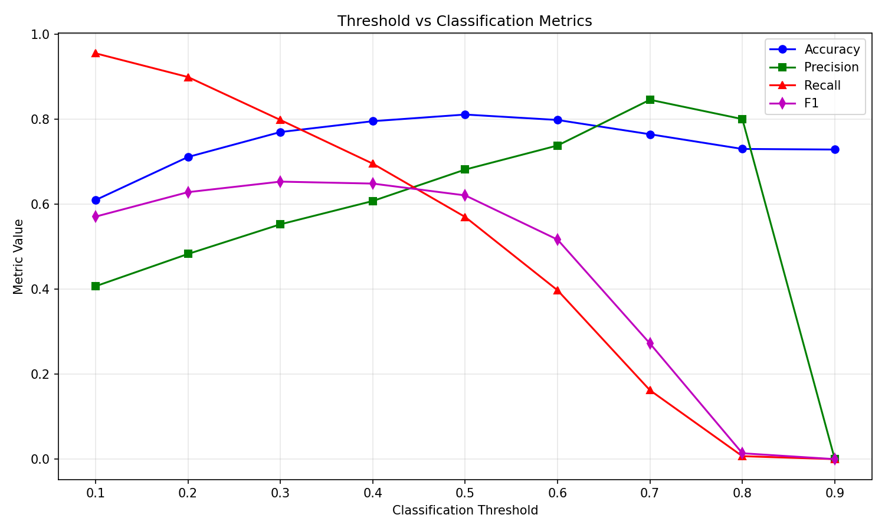
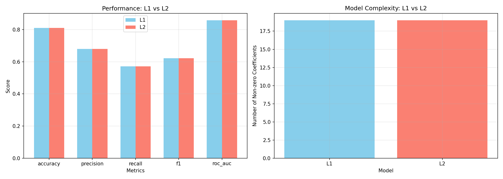

# Real Data Report: Telco Customer Churn

## Dataset Info
- Source: Kaggle Telco Customer Churn
- Samples: 7043, Features: 19
- Positive class ratio (Churn): 0.2654

## Confusion Matrix
```
[[1386  153]
 [ 247  327]]
```

## Performance Metrics
| Metric | Value |
|--------|-------|
| accuracy | 0.8107 |
| precision | 0.6813 |
| recall | 0.5697 |
| f1 | 0.6205 |
| roc_auc | 0.8582 |

## Threshold Analysis


## L1 vs L2 Regularization


## Business Interpretation
1. **Accuracy alone is misleading**: With ~73% non-churn, a dumb model could get 73% accuracy.
2. **Most trusted metric**: Recall, because missing a churner (FN) is more costly than false alarm (FP).
3. **Probability over class**: Emphasize probability to business teams for risk-based decision making.
