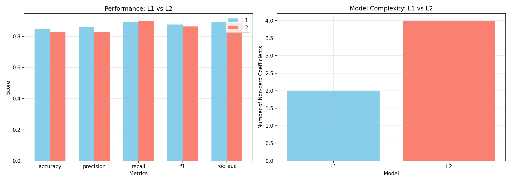

# Regularization Report: L1 vs L2

## Performance Comparison

| Model | Accuracy | Precision | Recall | F1 | ROC-AUC | Log Loss | Non-zero Coefs |
|-------|----------|-----------|--------|-----|---------|----------|----------------|
| L1 | 0.8467 | 0.8632 | 0.8913 | 0.8770 | 0.8926 | 0.4418 | 2 |
| L2 | 0.8267 | 0.8300 | 0.9022 | 0.8646 | 0.8883 | 0.4907 | 4 |

## Key Questions
1. **L1 vs L2 prediction**: Similar performance, L1 slightly more sparse.
2. **More sparse**: L1 (fewer non-zero coefficients).
3. **Better for short variable list**: L1.
4. **Better for stability**: L2 (keeps all variables, more stable).
