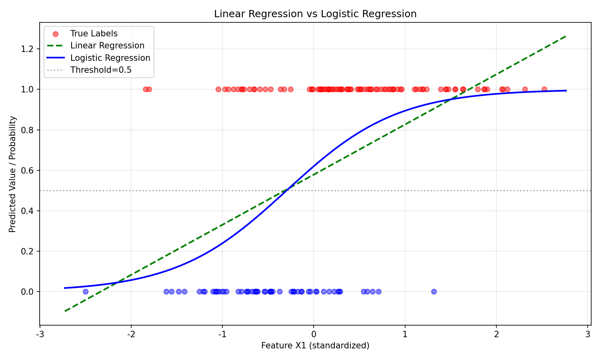
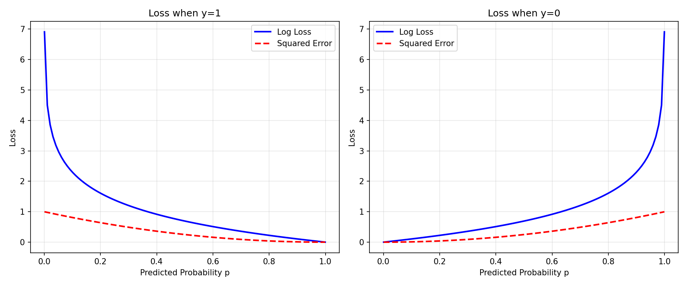

# Synthetic Data: Logistic Regression Report

## 1. Data Generation (DGP)
- Samples: 500, Features: 4
- Beta: [2.0, -1.5, 0.0, 0.0]
- Intercept: 0.5
- DGP: eta = X@beta + intercept, p = sigmoid(eta), y ~ Bernoulli(p)

## 2. Confusion Matrix
```
[[47 11]
 [13 79]]
```

## 3. Model Comparison

- Linear Regression outputs unbounded values, cannot be interpreted as probability.
- Logistic Regression outputs valid probabilities in [0, 1].

## 4. Loss Curves

- Log loss heavily penalizes confident mistakes, MSE penalizes linearly.
