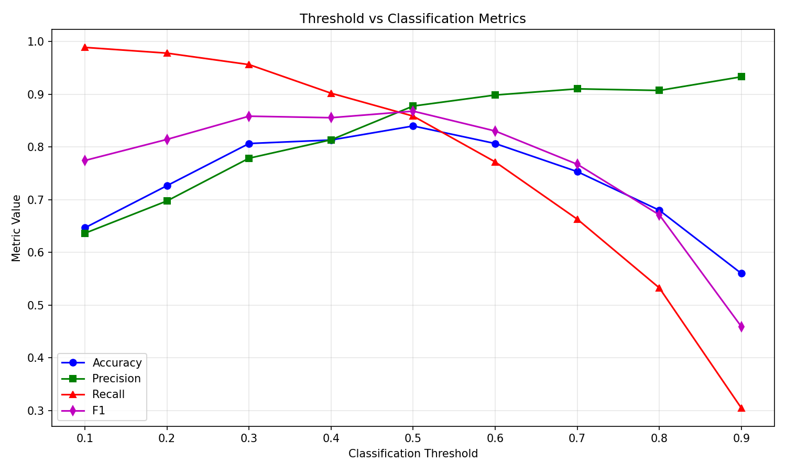

# Threshold Analysis Report

## Formulas

### Bernoulli Distribution
$$Y \sim Bernoulli(p)$$
Y takes value 1 with probability p, 0 with probability 1-p.

### Likelihood
$$L(p; y) = p^y (1-p)^{1-y}$$
For a single observation, this is the probability of observing y given p.

### Negative Log-Likelihood (Log Loss)
$$-\log L(p; y) = -[y\log p + (1-y)\log(1-p)]$$
Maximizing likelihood is equivalent to minimizing log loss.

## Threshold Scan Results

| Threshold | Accuracy | Precision | Recall | F1 |
|-----------|----------|-----------|--------|-----|
| 0.1 | 0.6467 | 0.6364 | 0.9891 | 0.7745 |
| 0.2 | 0.7267 | 0.6977 | 0.9783 | 0.8145 |
| 0.3 | 0.8067 | 0.7788 | 0.9565 | 0.8585 |
| 0.4 | 0.8133 | 0.8137 | 0.9022 | 0.8557 |
| 0.5 | 0.8400 | 0.8778 | 0.8587 | 0.8681 |
| 0.6 | 0.8067 | 0.8987 | 0.7717 | 0.8304 |
| 0.7 | 0.7533 | 0.9104 | 0.6630 | 0.7673 |
| 0.8 | 0.6800 | 0.9074 | 0.5326 | 0.6712 |
| 0.9 | 0.5600 | 0.9333 | 0.3043 | 0.4590 |

## Business Scenario: Credit Default
- Most important: Recall (catch defaulters)
- Recommended threshold: 0.3 (lower threshold to catch more positives)
